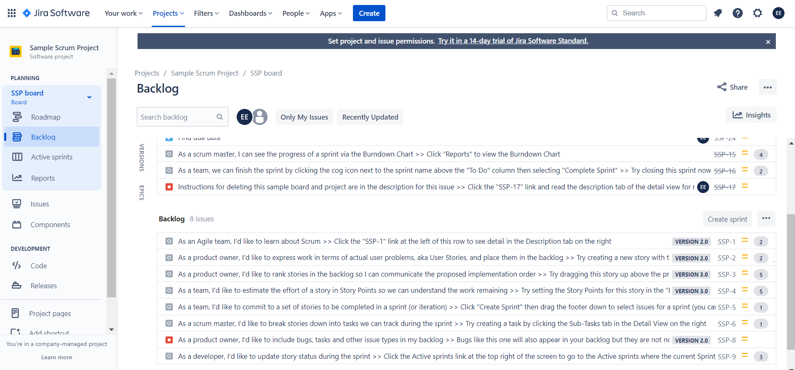
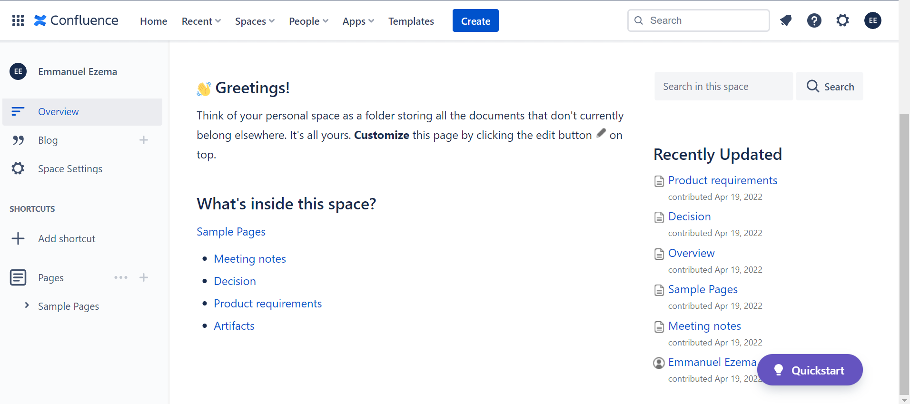

# Project-Management-Portfolio

## Professional Summary

Motivated project management (PM) professional, passionate about bringing ideas to life. Proficient in project and event management, cross-team communication, and customer service. Enjoys finding creative solutions in customer service (CRM), finance, real etste, and web development initiatives. A solution-driven individual with experience in solving complex problems. Proficient in managing supplier relationships, administrative contacts, and learning new technologies. Highly efficient at coaching and mentoring agile teams.

## Projects

The projects I have led are as follows:  

#### Real Estate Software
  <ul>
<li>Project Goal: A Software that can meet client/customer Real Estate needs 
<li>Project Scope: Should have a property hub, portfolio management capabilities, receive payments, make payments, and send notifications. 
<li>Success Criteria: 100% adoption by customers 2 months after project completion.  
<li>Resources: Comprises a 10-member team. 
<li>Timeline: 9 months. 
<li>Risks & Mitigation: Data on proposed user-specific needs was not readily available. The risk was mitigated by resulting in interviews with external subject matter experts (SMEs). 
  </ul> 
  
 #### Loan disbursement software
  <ul>
<li>Project Goal: A Sofware that can meet the client/customer loan needs by connecting an ERP loan software to the client's built portal and mobile app via APIs.  
<li>Project Scope: Should be able to disburse different loan types, e.g., amortized, simple interest, and bullet loans. Should also be able to receive payment and keep track of loan repayment schedule. Connect all the loan features via APIs and document their dependencies, variables and ENVs.  
<li>Success Criteria: 100% adoption by customers 2 months after project completion.  
<li>Resources: Comprises a 9-member team with a budget of N1,300,000. 
<li>Timeline: 1 month. 
<li>Risks & Mitigation: The timeline was not feasible for a 9-member team to connect and document all required APIs. As a remedy, the timeline got extended by two weeks. 
  </ul>
   

 #### Property Valuation; Nigerian Postal Services (NIPOST)
  <ul>
<li>Project Goal: Valuation for sale. 
<li>Project Scope: NIPOST premises in Enugu and Ebonyi. 
<li>Success Criteria: Arriving at an accurate property value in line with market comparable.  
<li>Resources: Comprises a 6-member team with a budget of N1,000,000. 
<li>Timeline: 14-days.
<li>Risks & Mitigation: Traveling in between towns proved difficult because they were mainly remote areas with bad roads.
 </ul>
  

 #### Property Valuation; Admore Filling Station 
 <ul>
<li>Project Goal: Valuation for a mortgage.
<li>Project Scope: Admore Filling Station premises in Nsukka, Enugu, Nigeria.
<li>Success Criteria: Arriving at an accurate property value in line with market comparable.  
<li>Resources: Comprises a 4-member team with a budget of N200,000.
<li>Timeline: 7-days.
<li>Risks & Mitigation: It took longer than expected to gather first-hand data on the average number of customers the business serviced during peak periods. Notwithstanding, the project was finished on time. 
 </ul>

## PM Artifacts 

  <a href='https://docs.google.com/spreadsheets/d/1wUYJrslP6XoRTL9z1hjnLgaBIhkXx6tVlkvUxYJVCJw/edit#gid=300282276' > 
   
   
  <caption>Image Link to my PM Artifacts</caption>
  </a>

## Appending 

 
<caption>Issues On The Jira Board</caption>

 

 
<caption>Confleunce Space For Project News Updates</caption>

## Contact Information 
Onyedikachi Emmanuel Ezema  
emmanuelkachiii@gmail.com  
+2348142230727  
<a href='https://www.linkedin.com/in/onyedikachi-ezema-87b43b1b7' > Linkedin Profile </a>

